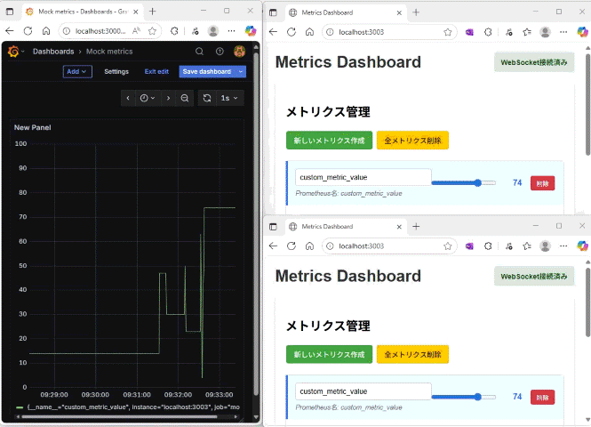

# Mock Exporter

Prometheusメトリクス用のモックエクスポーターアプリケーション。
リアルタイムでメトリクスの作成・更新を行うことができます。

アラートルールのテストに使えます。



## 特徴

- **動的メトリクス作成**: Webインターフェースからメトリクスを動的に作成・削除
- **Prometheus互換**: `/metrics`エンドポイントでPrometheusフォーマットのメトリクスを提供
- **リアルタイム同期**: 複数のブラウザでアクセスした場合にもWebSocketを使用した設定の同期
- **Webhook受信**: WebSocketを通じてWebhookメッセージをリアルタイム表示

## 技術スタック

- **Django**: Webフレームワーク
- **Django Channels**: WebSocketサポート
- **Prometheus Client**: メトリクス生成
- **Daphne**: ASGI Webサーバー

## セットアップ

### 1. 依存関係のインストール

```bash
uv sync
```

### 2. データベースセットアップ

```bash
uv run python manage.py migrate
```

### 3. アプリケーション起動

```bash
uv run daphne mock_exporter.asgi:application -p 3003
```

アプリケーションは http://localhost:3003 で利用可能になります。

## API エンドポイント

### Prometheus メトリクス
```
GET /metrics
```
Prometheusフォーマットのメトリクスを取得

### Webhook受信
```
POST /webhook/
```
Webhookメッセージをクライアントに送信

例：
```powershell
# JSONメッセージを送信
Invoke-RestMethod -Uri "http://localhost:3003/webhook/" -Method POST -ContentType "application/json" -Body '{"message": "Hello from webhook!"}'

# プレーンテキストを送信
Invoke-RestMethod -Uri "http://localhost:3003/webhook/" -Method POST -ContentType "text/plain" -Body "Simple text message"
```

### メトリクス管理API

- `GET /api/metrics/` - メトリクス一覧取得
- `POST /api/metrics/create/` - 新しいメトリクス作成
- `POST /api/metrics/update/` - メトリクス値更新
- `POST /api/metrics/delete/` - メトリクス削除
- `POST /api/metrics/select/` - 現在のメトリクス選択

## 使用方法

1. **メトリクス作成**: ダッシュボードで「新しいメトリクス作成」ボタンをクリック
2. **値の更新**: メトリクス名または値を編集してリアルタイム更新
3. **Prometheusモニタリング**: `/metrics`エンドポイントをPrometheusのターゲットとして設定
4. **Webhook受信**: 外部システムからWebhookメッセージを送信してリアルタイム表示

## プロジェクト構造

```
mock_exporter/          # Django設定
metrics_app/           # メインアプリケーション
  templates/           # HTMLテンプレート  
  static/             # CSS/JavaScriptファイル
  views.py            # APIビューとロジック
  consumers.py        # WebSocketコンシューマー
```

